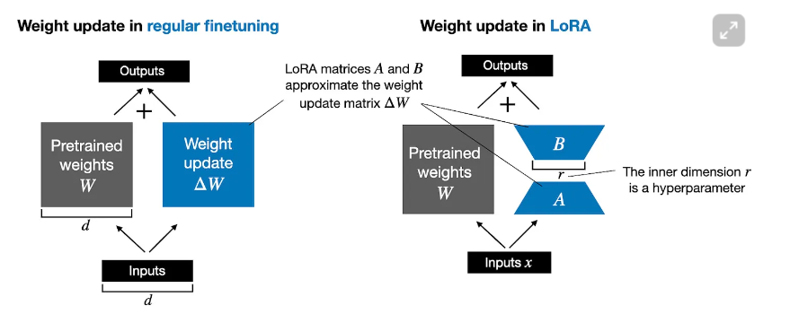
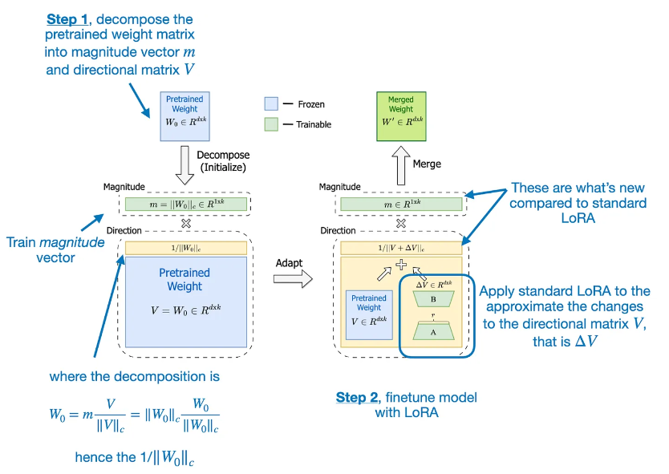
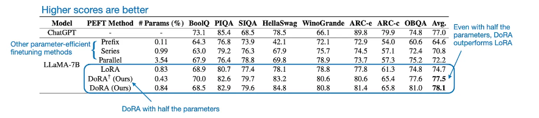

# Trainning GenAI model with low resource

17/06/2024: I read paper name DORA, which is accept in ICML2024 (https://arxiv.org/pdf/2402.09353)

This paper is a update version of another famous paper name "LORA" (https://arxiv.org/pdf/2106.09685)

Basicly, Lora introduce an solution for trainning Large model with low-resource, Key-layers of Large model (Large language model or Diffusion model) is Transformer (base on Attension-layer)

The attention mechanism can be described by the following formula:

```math
\[
\text{Attention}(Q, K, V) = \text{softmax}\left(\frac{QK^T}{\sqrt{d_k}}\right)V
\]
where:
- \(Q\) is the query matrix.
- \(K\) is the key matrix.
- \(V\) is the value matrix.
- \(d_k\) is the dimension of the keys (or queries).
- \(QK^T\) is the dot product between the query and key matrices.
- \(\sqrt{d_k}\) is the scaling factor to prevent the dot product values from growing too large.
- \(\text{softmax}\) is the softmax function applied to the dot product results to obtain the attention weights.

The resulting matrix from the softmax function is then multiplied by the value matrix \(V\) to get the final output of the attention mechanism.
```

multiplication 2 matrix Q and K^T take a lot of resource, for reduce it, Lora get idea from SVD , reduce rank of Q and K^T for trainning. 



An matrix have 2 part, one is magnitude vector (m) and another is directional matrix (V). 

The motivation for developing DoRA is based on analyzing and comparing the LoRA and full finetuning learning patterns. The DoRA authors found that LoRA either increases or decreases magnitude and direction updates proportionally but seems to lack the capability to make only subtle directional changes as found in full finetuning. Hence, the researchers propose the decoupling of magnitude and directional components. 

In other words, their DoRA method aims to apply LoRA only to the directional component, V, while also allowing the magnitude component, m, to be trained separately.

Dora just update a little bit technique from Lora, But effect of it is very impressed. 



This is experiment, compare between DORA trainning, LORA trainning and Full fineture. 



in some case, Dora have higher accuricy than full-finetune. (it's cool)

Question: 
- In some specific task, seem like Dora have higher accuracy than Lora and Full-finetune. But i want more information about effect of Dora in another task, which not in specific domain trained with Dora. Maybe, Dora made model overfit on specific task (just my thought) ?

Anw, Dora is small update but high effect, protential way for tranfer learning :))